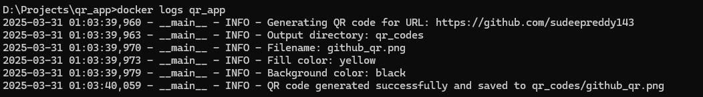

# QR Code Generator with Docker

This project provides a simple, containerized application for generating QR codes directly from your command line. Leveraging Docker for easy deployment and Python's `qrcode` library for generation, this tool allows you to quickly create QR codes for URLs and save them to your local system.

## Features

* **Containerized:** Runs in a Docker container, ensuring consistent behavior across different environments.
* **Customizable:** Allows you to specify the URL, colors, and output filename via environment variables or command-line arguments.
* **Easy Deployment:** Requires only Docker to run, eliminating the need for complex setup.
* **Direct Volume Mounting:** Save generated QR codes directly to your host machine.

## Getting Started

### Prerequisites

* [Docker](https://www.docker.com/get-started/) installed and running.

### Installation and Usage

1.  **Clone the Repository:**

    ```bash
    git clone <your-repo-url>
    cd <repository-directory>
    ```

2.  **Build the Docker Image:**

    ```bash
    docker build -t qr-code-generator .
    ```

3.  **Run the Container and Generate a QR Code:**

    * **Using Default Settings:**

        ```bash
        docker run -v $(pwd)/output:/app/qr_codes qr-code-generator
        ```

        This will generate a QR code for the default URL (a GitHub profile) and save it to the `output` directory in your current working directory.

    * **Specifying a Custom URL:**

        ```bash
        docker run -v $(pwd)/output:/app/qr_codes qr-code-generator --url "[https://example.com](https://example.com)"
        ```

    * **Customizing Colors and Filename:**

        ```bash
        docker run -v $(pwd)/output:/app/qr_codes \
        -e FILL_COLOR="blue" -e BACK_COLOR="yellow" \
        -e QR_CODE_FILENAME="custom.png" qr-code-generator
        ```

    * **Using Environment Variables:**
        You can also set the values within the docker-compose.yaml file, and then run `docker-compose up`.

4.  **View the Generated QR Code:**

    The QR code will be saved in the `output` directory in your current working directory. If you ran the default command, the image will be called `github_qr.png`.

    

5.  **Log generation screenshot:**

    The logs will be stored in `logs/info.log` and Docker logs.

    


## Project Structure

* `qr_generator.py`: Python script that generates the QR code.
* `Dockerfile`: Docker configuration for building the image.
* `requirements.txt`: Python dependencies.
* `docker-compose.yaml`: Docker compose configuration for building and running the container.
* `README.md`: This file.

## Customization

You can customize the QR code generation using the following options:

* **`--url`:** Specifies the URL to encode in the QR code.
* **`FILL_COLOR`:** Sets the fill color of the QR code (default: black).
* **`BACK_COLOR`:** Sets the background color of the QR code (default: white).
* **`QR_CODE_FILENAME`:** Specifies the filename of the generated QR code.

## Docker Commands

Here are some useful Docker commands:

* `docker build -t image_name .`: Builds a Docker image.
* `docker run -v local_dir:container_dir image_name`: Runs a container with volume mounting.
* `docker images`: Lists Docker images.
* `docker ps`: Lists running containers.
* `docker logs container_name`: Displays container logs.
* `docker stop container_name`: Stops a container.
* `docker rm container_name`: Removes a container.

## How It Works

1.  The Python script (`qr_generator.py`) uses the `qrcode` library to generate a QR code image.
2.  The Dockerfile builds a container image with the necessary dependencies.
3.  When you run the container, the script executes, generating the QR code.
4.  Volume mounting allows you to save the generated image directly to your local file system.

## Further Learning

* [Docker Documentation](https://docs.docker.com/)
* [Python qrcode Library](https://pypi.org/project/qrcode/)